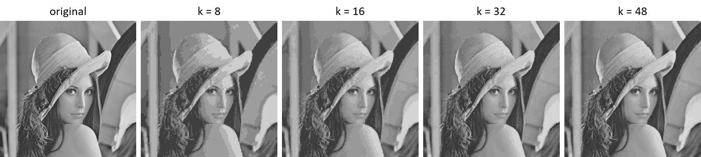

# Vector Quantization for Lossy Image Compression

Lossy Image Compression using Vector Quantization and K-Means Clustering.

## Results
Reconstructed images with different k (num of codevectors) values.

Tran Le Anh

01.2021
